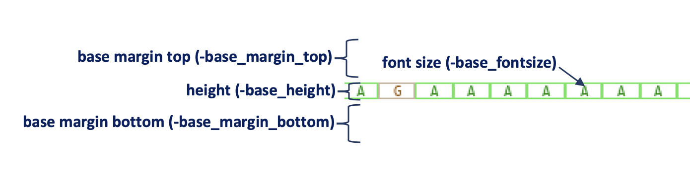
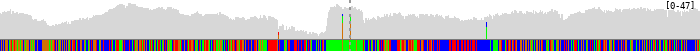
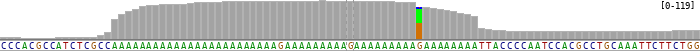
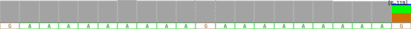

Base track (``-draw base``, ``-bamplot base``)
==============================================

Layout options
--------------

* ``-base_fontsize`` (default=9) : font size of base
* ``-base_height`` (default=30) : base track height
* ``-base_margin_top`` (default=0) : top margin size of base track
* ``-base_margin_bottom`` (default=0) : bottom margin size of base track

Base track types
----------------

Base track has three types which are determed automatically based on the width that a base can occupy.

.. code:: console

  $ bamsnap \
    -bam ./data/NA12879.bam \
    -draw bamplot \
    -bamplot coverage base \
    -pos chr10:117542948 \
    -separator_height 0 \
    -margin 500 \
    -no_title \
    -width 700 \
    -plot_margin_top 0 \
    -plot_margin_bottom 0 \
    -out ./out/NATRIO_chr10_117542948_baseplot_ex1.png

.. code:: console

  $ bamsnap \
    -bam ./data/NA12879.bam \
    -draw bamplot \
    -bamplot coverage base \
    -pos chr10:117542948 \
    -separator_height 0 \
    -margin 50 \
    -no_title \
    -width 700 \
    -plot_margin_top 0 \
    -plot_margin_bottom 0 \
    -out ./out/NATRIO_chr10_117542948_baseplot_ex2.png

.. code:: console

  $ bamsnap \
    -bam ./data/NA12879.bam \
    -draw bamplot \
    -bamplot coverage base \
    -pos chr10:117542948 \
    -separator_height 0 \
    -margin 10 \
    -no_title \
    -width 700 \
    -plot_margin_top 0 \
    -plot_margin_bottom 0 \
    -out ./out/NATRIO_chr10_117542948_baseplot_ex3.png
