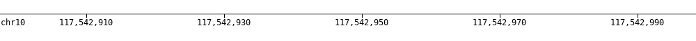
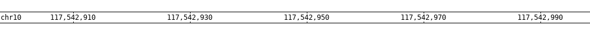

Coordinates track (``-draw coordinates``)
=========================================

* ``-coordinates_height`` (default=20) : `coordinates height <coordinates_plot.html>`_
* ``-coordinates_fontsize`` (default=12) : `coordinates font size <coordinates_plot.html>`_
* ``-coordinates_axisloc [top, bottom, middle]`` (default=bottom) : `coordinates axis location <coordinates_plot.html>`_
* ``-coordinates_bgcolor`` (default=FFFFFF) : `coordinates background color <coordinates_plot.html>`_
* ``-coordinates_labelcolor`` (default=000000) : `coordinates label color <coordinates_plot.html>`_

Axis location (``-coordinates_axisloc``)
----------------------------------------

* bottom location: ``-coordinates_axisloc bottom``

.. image:: ../tests/out/NATRIO_chr10_117542948_coordinates1.png
   :width: 100 %

* top location: ``-coordinates_axisloc top``

* middle location: ``-coordinates_axisloc middle``

