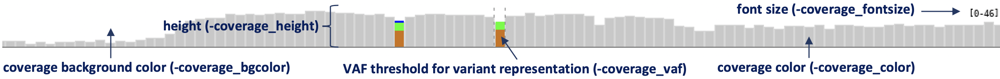

Coverage track (``-bamplot coverage``)
======================================

* ``-coverage_height`` (default=40) : coverage plot height
* ``-coverage_fontsize`` (default=9) : coverage font size
* ``-coverage_vaf`` (default=0.2) : coverage variant allele fraction threshold
* ``-coverage_color`` (default=C8C8C8) : coverage color
* ``-coverage_bgcolor`` (default=FFFFFFF) : coverage plot background color

