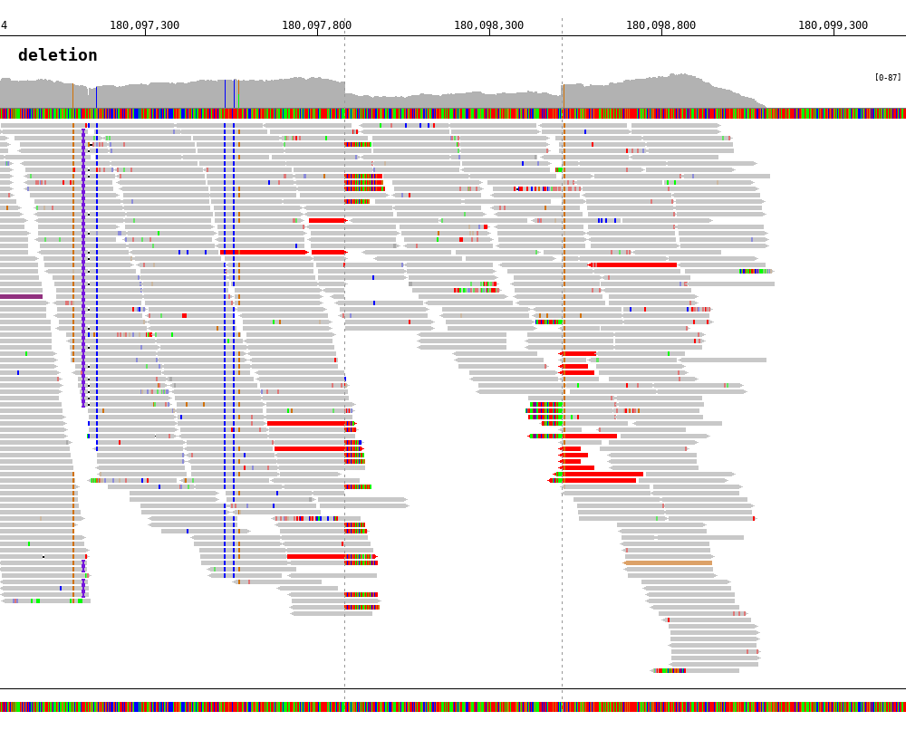

Gallery
=======

.. image:: https://raw.githubusercontent.com/parklab/bamsnap/master/tests/out/NATRIO_chr10_117542948.png
   :width: 100 %

.. code:: console

  $ bamsnap \
    -bam ./data/NA12879.bam \
    -title "NA12879 (Daughter)" \
    -pos chr10:117542948 \
    -out ./out/NATRIO_chr10_117542948.png \
    -read_group strand

.. image:: https://raw.githubusercontent.com/parklab/bamsnap/master/tests/out/NATRIO_chr9_114786933.png
   :width: 100 %

.. code:: console

  $ bamsnap \
    -bam ./data/NA12877.bam \
      ./data/NA12878.bam \
      ./data/NA12879.bam \
    -title "NA12877 (Father)" "NA12878 (Mother)" "NA12879 (Daughter)" \
    -pos chr9:114786933 \
    -out ./out/NATRIO_chr9:114786933.png \
    -draw coordinates bamplot base gene \
    -bamplot coverage base read \
    -margin 50 \
    -read_group strand \
    -plot_margin_left 20 \
    -plot_margin_right 20 \
    -border

.. code:: console

  $ bamsnap \
    -bam ./data/NA12879.bam \
    -pos chr10:117542948 \
    -no_title \
    -draw bamplot \
    -bamplot coverage \
    -out ./out/NATRIO_chr10_117542948_3.png \
    -separator_height 0

.. image:: ../tests/out/NATRIO_chr10_117542948_coordinates1.png
   :width: 100 %

.. code:: console

  $ bamsnap \
    -bam ./data/NA12879.bam \
    -pos chr10:117542948 \
    -no_title \
    -draw coordinates \
    -out ./out/NATRIO_chr10_117542948_coordinates1.png \
    -no_target_line \
    -coordinates_axisloc bottom

**Color by inter-chromosomal rearrangements**

.. image:: ../tests/out/test_SV1-3.png
   :width: 100 %

.. code:: console

  $ bamsnap \
    -bam ./data/test_SV1_chr1_37775710.bam \
    -title "SVA example (chr1:37775710)" \
    -pos chr1:37775710 \
    -out ./out/test_SV1-3.png \
    -bamplot coverage read \
    -margin 1000 \
    -no_target_line \
    -read_color_by interchrom \
    -save_image_only

**Deletion**

.. code-block:: console
   :linenos:

   $ bamsnap \
      -bam ./data/test_DEL_4_180097876_180097877.bam \
      -pos 4:180097878-180098507 \
      -margin 1000 \
      -title deletion \
      -out ./out/test_DEL_1.png \
      -refversion hg19 \
      -show_soft_clipped \
      -read_color_by interchrom \
      -save_image_only