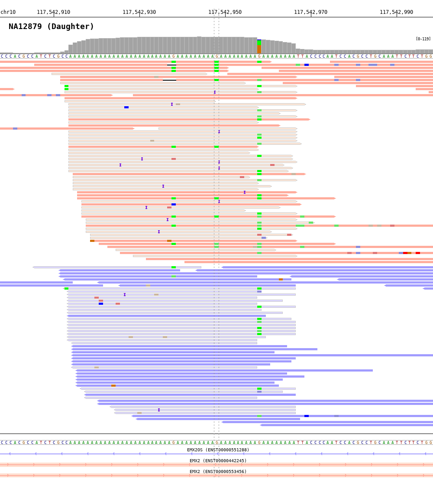

.. BamSnap documentation master file, created by
   sphinx-quickstart on Thu Jan  9 14:40:53 2020.
   You can adapt this file completely to your liking, but it should at least
   contain the root `toctree` directive.

BamSnap
=======

.. image:: https://img.shields.io/pypi/v/bamsnap.svg
   :target: https://pypi.org/project/bamsnap/
   :alt: Latest PyPI version

.. image:: https://img.shields.io/pypi/dm/bamsnap.svg
   :target: https://pypi.org/project/bamsnap/
   :alt: Number of PyPI downloads

.. image:: https://readthedocs.org/projects/bamsnap/badge/?version=latest
   :target: https://bamsnap.readthedocs.io/en/latest/
   :alt: Documentation of BamSnap

**BamSnap** is a visualization tool for aligned BAM files that allows to generate high-quality snapshots of read level data in high-throughput, processing up to thousands of files.
**BamSnap** is a command-line software based on python.

Setting up BamSnap
---------------
In a command prompt or terminal window, run the following commands to install and test the software.

.. code:: console

  $ pip install bamsnap
  $ bamsnap -bam test.bam -pos chr1:7364529 -out test.bam.png

More examples and commands are available in `gallery <gallary.html>`_. Use ``-h`` to list the options available for ``bamsnap``.

.. code:: console

  $ bamsnap -h

Source code is available on `github <https://github.com/parklab/bamsnap>`_.

Contents
--------

.. toctree::
   :numbered:
   :maxdepth: 4

   installation.rst
   gallary.rst
   options.rst
   input.rst
   output.rst
   plot.rst
   read_plot.rst
   coverage_plot.rst
   base_plot.rst
   gene_plot.rst
   coordinates_plot.rst
   heatmap.rst
   version_history.rst

.. * :ref:`genindex`
.. * :ref:`modindex`
.. * :ref:`search`
