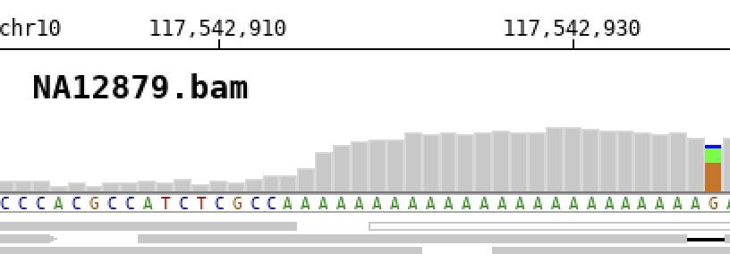
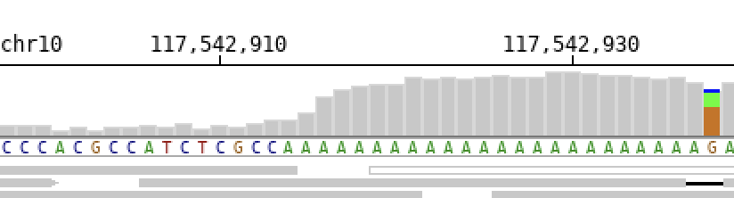

Input files
===========

Alignment file
--------------

**BamSnap** requires sorted and indexed bam or cram files. For each alignment file, the index file (`.bam.bai`, `.bai`, `.cram.crai`, or `.crai`) should be located in the same directory.

Input files (``-bam`` for BAM or CRAM format)
^^^^^^^^^^^^^^^^^^^^^^

Input files to be used can be specified using the ``-bam`` argument. It is possible to specify a single file or list multiple files. Also, a cram file can be assigned with ``-bam`` argument.

.. code:: console

    $ bamsnap -bam ./data/NA12878.bam
    $ bamsnap -bam ./data/NA12878.bam ./data/NA12877.bam ./data/NA12879.bam
    $ bamsnap -bam ./data/NA12878.cram
    $ bamsnap -bam ./data/NA12878.cram ./data/NA12877.bam ./data/NA12879.bam

.. note::
   BamSnap supports both the indexed BAM and the indexed CRAM format for the alignment files.

Title of alignment file(s) (``-title``)
:::::::::::::::::::::::::::::::::::::::

A label can be assigned to each of the bam files using the ``-title`` argument. The label will be used as title for the corresponding plot.

.. code:: console

    $ bamsnap -bam ./data/NA12879.bam -title NA12879
    $ bamsnap -bam ./data/NA12879.bam -title "NA12879  (Daughter)"
    $ bamsnap -bam ./data/NA12878.bam ./data/NA12877.bam ./data/NA12879.bam \
      -title "NA12877 (Father)" "NA12878 (Mother)" "NA12879 (Daughter)"

.. image:: img/pic_title1.png
   :width: 300 px

If no label is specified, the file name will be used as title by default.

To completely remove the title use the ``-no_title`` option.

.. code:: console

    $ bamsnap -bam ./data/NA12879.bam -no_title

.. note::
   By default, the title font size is 18. It is possible to change the font size with ``-title_fontsize`` (e.g. ``-title_fontsize 10``).

BAM list file (``-bamlist``)
^^^^^^^^^^^^^^^^^^^^^^^^^^^^

.. code:: console

    $ bamsnap -bamlist ./data/NATRIO_bamlist.txt

It is possible to provide a single file listing all the input bam files to be used. The expected format is a tabular (tab-separated) file. The first column is mandatory and must contain the paths to files, the second column is optional and allows to associate labels to files.
It also supports `.bam` and `.cram` file.

.. code:: bash

  # example of bamlist file with lables
  ./data/NA12878.bam    NA12878 (F)
  ./data/NA12877.cram   NA12877 (M)
  ./data/NA12879.bam    NA12879 (D)

.. code:: bash

  # example of bamlist file
  ./data/NA12878.bam
  ./data/NA12877.cram
  ./data/NA12879.bam

Genomic position
----------------

Genomic position (``-pos``)
^^^^^^^^^^^^^^^^^^^^^^^^^^^

Genomic positions to plot can be specified with the ``-pos`` option. It is possible to specify a single position or to list multiple regions.

.. code:: console

    $ bamsnap -bam ./data/NA12878.bam -pos chr1:7364529
    $ bamsnap -bam ./data/NA12878.bam -pos chr1:7364529 chr3:7364529 chr1:7364529
    $ bamsnap -bam ./data/NA12878.bam -pos chr1:7364509-7364559

.. note::
  Chromosome names must match between the positions that are specified and the bam files. For example, 'chr' prefix should be omitted from regions if the bam files don't use 'chr' prefix in chromosome names (ex. 1:7364529).

VCF file (``-vcf``)
^^^^^^^^^^^^^^^^^^^

The program can read ``.vcf`` (raw) and ``.vcf.gz`` (gzip or bgzip compressed vcf) files.

.. code:: console

    $ bamsnap \
      -bam ./data/NA12878.bam \
      -vcf ./data/multiple_variants.vcf.gz \
      -out ./out/mutiple_variants_NA12878

BED file (``-bed``)
^^^^^^^^^^^^^^^^^^^

.. code:: console

    $ bamsnap \
      -bam ./data/NA12878.bam \
      -bed ./data/multiple_regions.bed \
      -out ./out/mutiple_regions_NA12878

Reference sequence file
-----------------------

User can provide a fasta file to be used as reference using the ``-ref`` option. Alternatively, it is possible to specify a reference version to be used with ``-refversion``. The program will automatically obtain the corresponding sequence from UCSC database. The current default version for ``-refversion`` is ``hg38``. ``-refversion hg19`` force the use of ``hg19`` release.

FASTA file (``-ref``)
^^^^^^^^^^^^^^^^^^^^^

.. code:: console

    $ bamsnap \
      -bam ./data/NA12879.bam_chr10_117542947.bam \
      -ref ./fasta/GRCh38_full_analysis_set_plus_decoy_hla.fa

.. note::
  If a fasta file is specified, the program checks for its index file (.fai). If the index file does not exist it will be automatically created.
  If the index file exists but is older than the fasta file, the program can rebuild the index using the ``-ref_index_rebuild`` option.
