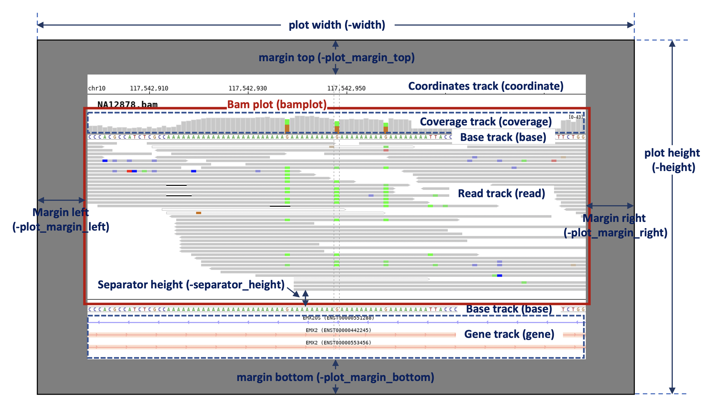

Plot options
============

Plot composition (``-draw``, ``-bamplot``)
------------------------------------------

To compose a plot, you can add track list with ``-draw``. The default list is ``coordinates bamplot base gene``. By default, the bamplot also has ``coverage base read`` tracks. 

* ``-draw`` : track list (default: -draw coordinates bamplot base gene)
* ``-bamplot`` : plot (default: -bamplot coverage base read)
	* ``-bamplot read`` : `see more track options <read_plot.html>`_
	* ``-bamplot coverage`` : `see more track options <coverage_plot.html>`_
	* ``-bamplot base`` : `see more track options <base_plot.html>`_

Plot layout options
-------------------

* ``-width`` : image file size : width (unit:px, default:1000)
* ``-height`` : image file size : height (unit:px)
* ``-bgcolor`` : background color (default:FFFFFF)
* ``-plot_margin_top`` : top margin size of plot
* ``-plot_margin_bottom`` : bottom margin size of plot
* ``-plot_margin_left`` : left margin size of plot
* ``-plot_margin_right`` : right margin size of plot
* ``-separator_height`` : separator's height
* ``-border`` : draw border in plot

