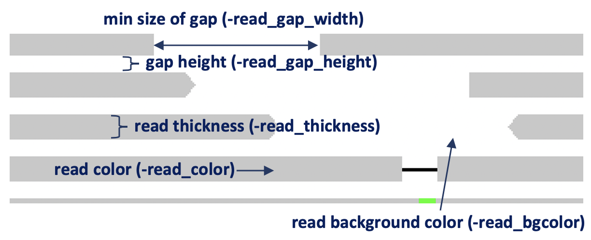
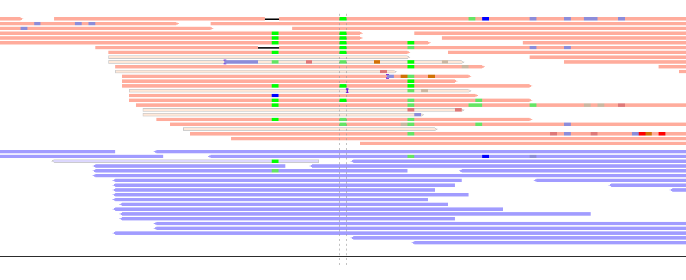
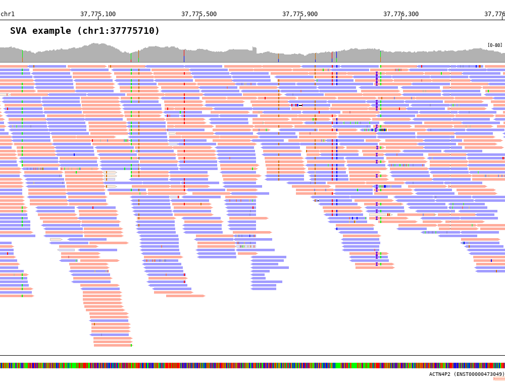
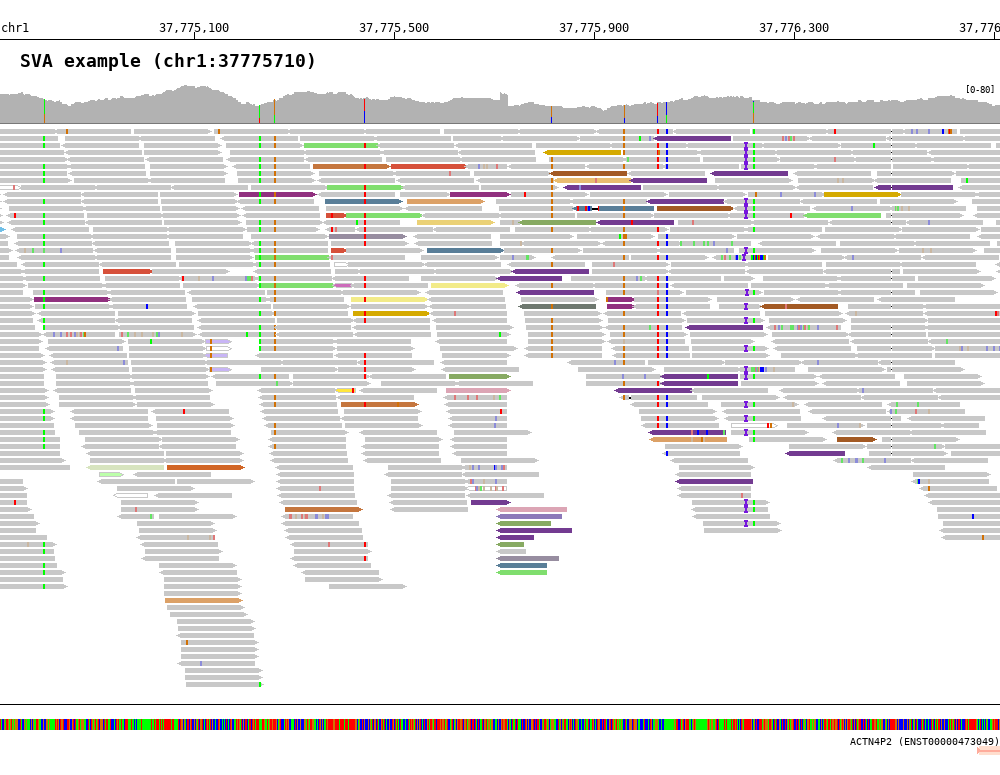

Read alignment track (``-bamplot read``)
========================================

Layout options
--------------

* ``-read_thickness`` (default=5) : read thickness (unit:px)
* ``-read_gap_height`` (default=2) : read gap height (unit:px)
* ``-read_gap_width`` (default=2) : min size of read gap width (unit:px)
* ``-read_bgcolor`` (default='FFFFFF') : read background color
* ``-read_color`` (default='C8C8C8') : read color
* ``-center_line`` (default=false): draw center line
* ``-no_target_line`` (default=false): do not draw target line

Read group (``-read_group``)
^^^^^^^^^^^^^^^^^^^^^^^^^^^^

**BamSnap** supports to group by read strand with ``-read_group strand``. In this case, ``-read_pos_color`` and ``-read_neg_color`` can be used for changing the grouped read color.

* ``-read_pos_color`` (default='FFAC9C') : positive strand read color
* ``-read_neg_color`` (default='A19CFF') : negative strand read color

.. code-block:: console
   :linenos:
   :emphasize-lines: 6,8

   $ bamsnap \
     -bam ./data/NA12879.bam \
     -pos chr10:117542948 \
     -no_title \
     -draw bamplot \
     -bamplot read \
     -out ./out/NATRIO_chr10_117542948_6.png \
     -read_group strand

Read color (``-read_color_by``)
^^^^^^^^^^^^^^^^^^^^^^^^^^^^^^^

BamSnap provides color sets for read strand and inter-chromosomal rearrangements.

Color by strand (``-read_color_by strand``)
*******************************************

.. code-block:: console
   :linenos:
   :emphasize-lines: 9

   $ bamsnap \
      -bam ./data/test_SV1_chr1_37775710.bam \
      -title "SVA example (chr1:37775710)" \
      -pos chr1:37775710 \
      -out ./out/test_SV1-4.png \
      -bamplot coverage read \
      -margin 1000 \
      -no_target_line \
      -read_color_by strand \
      -save_image_only

The read strand colors can be changed with ``-read_pos_color`` and ``-read_neg_color``.

Color by inter-chromosomal rearrangements (``-read_color_by interchrom``)
*************************************************************************

.. code-block:: console
   :linenos:
   :emphasize-lines: 9

   $ bamsnap \
      -bam ./data/test_SV1_chr1_37775710.bam \
      -title "SVA example (chr1:37775710)" \
      -pos chr1:37775710 \
      -out ./out/test_SV1-3.png \
      -bamplot coverage read \
      -margin 1000 \
      -no_target_line \
      -read_color_by interchrom \
      -save_image_only

The read colors can be changed with ``-read_color_interchrom_chr1``, ``-read_color_interchrom_chr2``, .., and ``-read_color_interchrom_chrY``.

.. role:: chr1
.. role:: chr2
.. role:: chr3
.. role:: chr4
.. role:: chr5
.. role:: chr6
.. role:: chr7
.. role:: chr8
.. role:: chr9
.. role:: chr10
.. role:: chr11
.. role:: chr12
.. role:: chr13
.. role:: chr14
.. role:: chr15
.. role:: chr16
.. role:: chr17
.. role:: chr18
.. role:: chr19
.. role:: chr20
.. role:: chr21
.. role:: chr22
.. role:: chr23
.. role:: chr24
.. role:: other

.. raw:: html

    

* Default color codes
   * :chr1:`chr1: #64689b ⬅⬅⬅⬅`
   * :chr2:`chr2: #D6503A ⬅⬅⬅⬅`
   * :chr3:`chr3: #87AA62 ⬅⬅⬅⬅`
   * :chr4:`chr4: #F2EB89 ⬅⬅⬅⬅`
   * :chr5:`chr5: #597E98 ⬅⬅⬅⬅`
   * :chr6:`chr6: #C5763E ⬅⬅⬅⬅`
   * :chr7:`chr7: #70BFE7 ⬅⬅⬅⬅`
   * :chr8:`chr8: #91307F ⬅⬅⬅⬅`
   * :chr9:`chr9: #80DE6E ⬅⬅⬅⬅`
   * :chr10:`chr10: #DCA5B5 ⬅⬅⬅⬅`
   * :chr11:`chr11: #A35A24 ⬅⬅⬅⬅`
   * :chr12:`chr12: #978DA0 ⬅⬅⬅⬅`
   * :chr13:`chr13: #D16525 ⬅⬅⬅⬅`
   * :chr14:`chr14: #DCA167 ⬅⬅⬅⬅`
   * :chr15:`chr15: #8C79B9 ⬅⬅⬅⬅`
   * :chr16:`chr16: #E9BD71 ⬅⬅⬅⬅`
   * :chr17:`chr17: #4B2669 ⬅⬅⬅⬅`
   * :chr18:`chr18: #D7E4BF ⬅⬅⬅⬅`
   * :chr19:`chr19: #733B91 ⬅⬅⬅⬅`
   * :chr20:`chr20: #BC2D7A ⬅⬅⬅⬅`
   * :chr21:`chr21: #EBD176 ⬅⬅⬅⬅`
   * :chr22:`chr22: #6E786F ⬅⬅⬅⬅`
   * :chr23:`chrX: #D5AA00 ⬅⬅⬅⬅`
   * :chr24:`chrY: #A9D400 ⬅⬅⬅⬅`
   * :other:`other chromosome: #555555 ⬅⬅⬅⬅`

